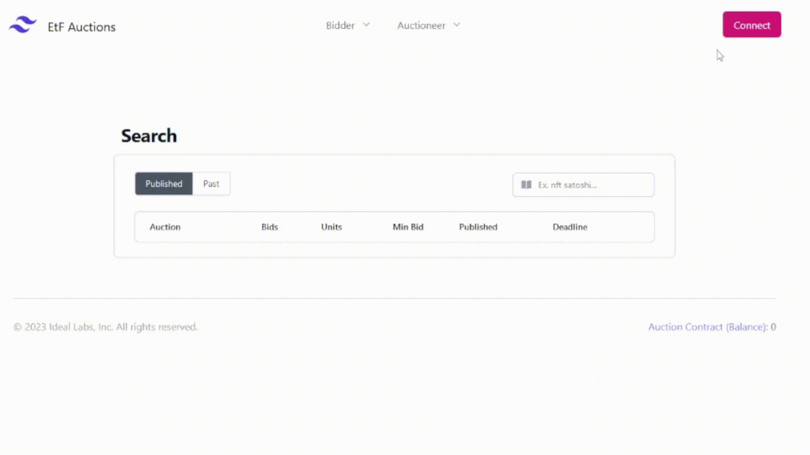

# Timelock Auction Dapp

This is an interface which interacts with the [timelock auction contracts](https://github.com/ideal-lab5/contracts/tree/main/timelock_auction). It uses polkadotjs and etf.js to encrypt bids for the future, ensuring that bids can only be revealed after the auction has passed its deadline.

<picture>
  <source media="(prefers-color-scheme: dark)" srcset="./assets/web3%20foundation_grants_badge_white.png">
  
</picture>

## Usage

The auction dapp is hosted on our testnet, accessible at https://auction.idealabs.network. It allows participants to participate in auctions of ERC721 tokens. 


### Prerequisites

- install the [polkadotjs extension](https://polkadot.js.org/extension/) and create an address
- Send us a message on [element](https://matrix.to/#/!WNjsSVgwXxgopDOSPj:matrix.org?via=matrix.org) to request access and tokens.
 

<div style="display: grid;">
    
</div>

## Setup

### Configure .env

Create a local `.env.local` and fill in the details below. The contract must be deployed on the network that the node is connected to.

``` shell
NEXT_PUBLIC_CONTRACT_ADDRESS="the address of the proxy contract"
NEXT_PUBLIC_NODE_DETAILS="fully qualified url of the node"
```
### Run from sources

```bash

npm i && run dev
```

### Docker

#### Run

The project can be run from the docker image by running:

``` bash
docker pull ideallabs/etf-auction-ui
docker run -p 3000:3000 --rm ideallabs/etf-auction-ui
```

#### Build

To build the docker image, from the root, execute:

``` bash
docker-compose build
```

### As a static site

This project can also be run as a static site, which can then be hosted in IPFS, for example.

In order to use as a static site, generate the `out` directory by running:

``` bash
npm run export
```

The static site is generated in the generated directory. Not that this will run a custom script, `replacer.js`, which handles replacing file paths in the generated build. See this [open issue](https://github.com/vercel/next.js/issues/8158) on the next.js github for more insights into why this is done.
